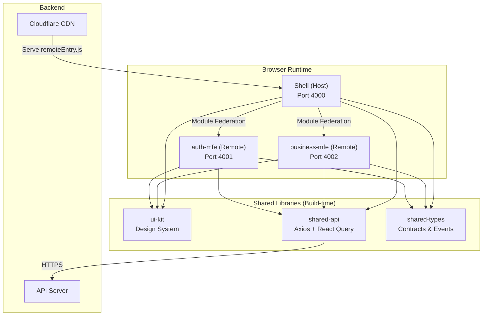
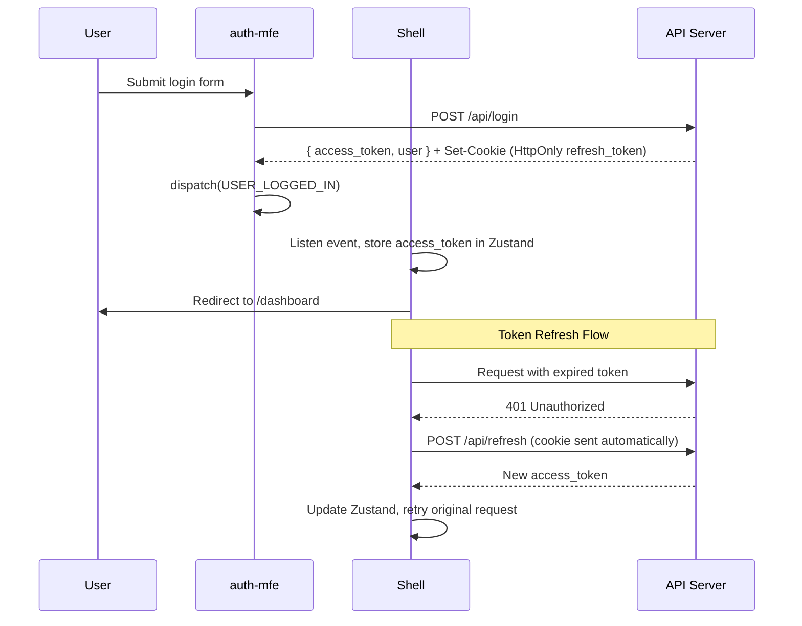
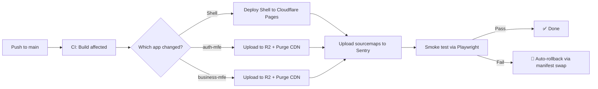

# PRD: Scalable & Secure Micro Frontend Architecture

| | |
|---|---|
| **Versi** | 3.0 — Complete with Best Practices |
| **Tim** | Antygraviti |
| **Tanggal** | 2026 |
| **Status** | ✅ Siap Eksekusi |
| **Target Demo** | Shell + 1 Remote MFE |

---

## 1. Ringkasan Eksekutif

Membangun fondasi arsitektur frontend modular yang memungkinkan beberapa tim bekerja secara paralel pada fitur yang berbeda (Auth, Dashboard, dll.) tanpa saling mengganggu, dengan keamanan tingkat tinggi dan performa build yang dioptimalkan untuk mesin Apple Silicon M4.

### 🎯 Status Implementasi (Berdasarkan Audit Terakhir)

**✅ Selesai Dikerjakan:**
- [x] **P1: Monorepo Foundation** (Nx, pnpm, Tailwind, Husky, ESLint)
- [x] **P3: Federation PoC** (Shell, Auth-MFE, Remote config, Routing)
- [x] **P4: Design System & UI Kit** (Komponen dasar lengkap: Button, Card, Table, Tabs, dll)
- [x] **P5: Shared API Layer** (Axios interceptor, React Query setup)
- [x] **P7: i18n & a11y** (react-i18next setup, struktur dictionary)
- [x] **P9: Monitoring (Dasar)** (Sentry terintegrasi)

**⏳ Sedang Berjalan / Sebagian:**
- [ ] **P2: Dev Env & Auth Flow** (Auth flow ada, tapi **MSW Mocking** belum ada)
- [ ] **P6: Security & CSP** (Audit CI ada, tapi **Zod** schema dan **CSP Nonce** belum diimplementasi)
- [ ] **P10: Testing** (Library E2E/Unit ada, test cases belum ter-cover penuh)

**❌ Belum Dikerjakan Sama Sekali:**
- [ ] **P8: CI/CD Pipeline** (Pipeline GitHub Actions, bundle size limit, auto deployment CDN belum ada)

---

## 2. Technical Stack (2026 Standard)

| Komponen | Teknologi | Versi |
|---|---|---|
| Manager | Nx (Monorepo) | v20+ |
| Package Manager | pnpm (mode isolated) | v10+ — **WAJIB** |
| Runtime | Node.js LTS | v24 |
| Bundler | Vite + @module-federation/vite | v6+ |
| Framework | React (Stable) | v19 |
| Compiler | React Compiler | Enabled |
| Language | TypeScript (Strict Mode) | 5.7+ |
| Styling | Tailwind CSS | v4+ |

---

## 3. Arsitektur & Struktur Folder

Sistem menggunakan pola **Hybrid Monorepo**. Kode dikelola di satu tempat, tapi di-deploy sebagai entitas terpisah.

```text
/
├── apps/
│   ├── shell/           # Host: Orchestrator, Auth Guard, Global Layout
│   ├── auth-mfe/        # Remote: Login, Register, Profile Management
│   └── business-mfe/    # Remote: Core Feature (Dropshipping logic)
├── libs/
│   ├── ui-kit/          # Atomic UI (Design System), Tailwind Config
│   ├── shared-api/      # Axios/React Query setup, Endpoint definitions
│   └── shared-types/    # TypeScript Interfaces (Source of truth)
├── package.json
├── tools/
│   └── scripts/          # Custom Nx generators, CI helpers
└── pnpm-workspace.yaml
```

### 3.1 Architecture Diagram ✨ BARU



### 3.2 Auth Flow Sequence Diagram ✨ BARU



---

## 4. Spesifikasi Module Federation

- **Manifest-based Federation:** Gunakan sistem manifest untuk resolusi URL remote secara dinamis (jangan hardcoded).

### Shared Dependencies Policy

| Package | Mode | Keterangan |
|---|---|---|
| `react`, `react-dom` | Singleton, Required | Wajib satu instance di runtime |
| `lucide-react` | Shared | Boleh di-share antar remote |
| `framer-motion` | Shared | Boleh di-share antar remote |

- **Resilience:** Setiap remote import wajib dibungkus `React.Suspense` dan `Error Boundary` di level Shell. Jika satu modul crash, aplikasi utama tidak boleh mati.

### 4.1 Dynamic Remote Discovery ✨ BARU

Meninggalkan *hardcoded* remote URLs di konfigurasi `vite.config.ts` untuk menggunakan registry map dinamis di runtime via `remotes.json`:
- `remotes.json` di `shell/public/` menentukan URL manifest untuk masing-masing MFE (contoh: `http://localhost:4003/mf-manifest.json`).
- Shell dapat me-load konfigurasi terbaru di environment staging/production tanpa perlu me-rebuild Shell itu sendiri, memudahkan tim untuk mengubah versi/deploy remote secara independen.

### 4.2 Routing Strategy ✨ BARU

> Tanpa strategi routing yang jelas, deep linking dan navigasi antar-MFE akan bermasalah.

#### Ownership Model

| Layer | Owner | Tanggung Jawab |
|---|---|---|
| Root Router | Shell | Top-level routes (`/auth/*`, `/app/*`, `/`) |
| Sub Routes | Masing-masing Remote | Internal routing di dalam MFE |
| 404 / Catch-all | Shell | Fallback untuk route yang tidak ditemukan |

#### Route Registration

Setiap remote MFE wajib meng-export route configuration dari entry point-nya:

```typescript
// auth-mfe/src/routes.tsx
import { lazy } from 'react';

const LoginPage = lazy(() => import('./pages/Login'));
const RegisterPage = lazy(() => import('./pages/Register'));
const ProfilePage = lazy(() => import('./pages/Profile'));

export const authRoutes = [
  { path: 'login',    element: <LoginPage /> },
  { path: 'register', element: <RegisterPage /> },
  { path: 'profile',  element: <ProfilePage /> },
] satisfies RouteObject[];
```

```typescript
// Shell route integration
import { authRoutes } from 'authMfe/routes';

const router = createBrowserRouter([
  {
    path: '/auth',
    element: <AuthLayout />,
    children: authRoutes,  // delegated to remote
  },
  {
    path: '/app',
    element: <ProtectedLayout />, // Auth Guard di sini
    children: businessRoutes,
  },
  {
    path: '*',
    element: <NotFoundPage />,
  },
]);
```

#### Deep Linking Support

- Semua route harus bisa diakses langsung via URL (no hash-based routing).
- Shell harus handle initial load dari path apapun dan resolve ke remote yang benar.
- Bookmark dan share link harus berfungsi.

#### Route Transition Performance

- Target: perpindahan antar route **< 300ms** tanpa full page reload.
- Gunakan `React.lazy()` + `Suspense` untuk code-split per route.
- Prefetch remote chunk saat hover pada navigation link.

---

## 5. Kontrak Komunikasi Antar-MFE ✨ BARU

> Ini adalah salah satu spesifikasi paling kritis. Tanpa kontrak yang jelas, tim akan konflik di hari pertama.

### 5.1 Mekanisme Komunikasi

| Skenario | Mekanisme | Contoh |
|---|---|---|
| Notifikasi satu arah | Custom Browser Events | `auth-mfe` dispatch `USER_LOGGED_IN` |
| State global ringan | Shared Zustand store (via shared-types) | `userStore`, `cartStore` |
| Data server | React Query (via shared-api) | `useUserProfile()`, `useOrders()` |
| Navigasi antar-MFE | Shell Router (React Router v7) | Shell yang memiliki router utama |

### 5.2 Custom Event Contract

Semua event yang di-dispatch antar-MFE wajib menggunakan prefix namespace dan didefinisikan di `shared-types`.

```typescript
// libs/shared-types/src/events.ts

export const MFE_EVENTS = {
  AUTH: {
    USER_LOGGED_IN:  'antygraviti:auth:user_logged_in',
    USER_LOGGED_OUT: 'antygraviti:auth:user_logged_out',
    TOKEN_REFRESHED: 'antygraviti:auth:token_refreshed',
  },
  BUSINESS: {
    ORDER_CREATED:   'antygraviti:business:order_created',
  }
} as const;

export interface AuthEventPayload {
  userId: string;
  accessToken: string;
  expiresAt: number;
}
```

### 5.3 Error Boundary UI Fallback Standard

Setiap remote crash wajib menampilkan UI fallback yang sudah ditentukan. Jangan biarkan halaman putih.

| State | UI yang Ditampilkan | Aksi User |
|---|---|---|
| Loading (Suspense) | Skeleton dengan shimmer effect | Tunggu otomatis |
| Error (crashed) | Card error + tombol Retry | Klik Retry untuk reload modul |
| Network timeout | Pesan offline + tombol Refresh | Refresh halaman |

### 5.4 State Management Strategy ✨ BARU

> Tanpa spesifikasi jelas, setiap MFE akan bikin store sendiri dan konflik.

#### Store Registry

| Store | Owner | Scope | Shared? |
|---|---|---|---|
| `authStore` | Shell | Global — token, user info | ✅ Ya, via shared-types |
| `themeStore` | Shell | Global — dark mode, accent color | ✅ Ya, via shared-types |
| `notificationStore` | Shell | Global — toast queue | ✅ Ya, via shared-types |
| Local component state | Masing-masing MFE | Lokal | ❌ Tidak |

#### Sharing Mechanism

Global stores didefinisikan di `shared-types`, dibuat di Shell, dan di-pass ke remote via Module Federation `exposes`:

```typescript
// libs/shared-types/src/stores/auth-store.ts
import { create } from 'zustand';

export interface AuthState {
  accessToken: string | null;
  user: User | null;
  setAuth: (token: string, user: User) => void;
  clearAuth: () => void;
}

export const createAuthStore = () => create<AuthState>((set) => ({
  accessToken: null,
  user: null,
  setAuth: (accessToken, user) => set({ accessToken, user }),
  clearAuth: () => set({ accessToken: null, user: null }),
}));
```

#### Hydration on Page Refresh

- Access token di memory **akan hilang** saat refresh. Ini by design (security).
- Saat refresh, Shell wajib hit `POST /api/refresh` untuk mendapat token baru dari HttpOnly cookie.
- Tampilkan loading skeleton selama proses re-hydration.
- React Query cache menggunakan `staleTime: 5 * 60 * 1000` (5 menit) agar tidak refetch berlebihan.

---

## 6. Authentication Flow End-to-End ✨ BARU

> Spesifikasi ini wajib diikuti agar tidak ada konflik ownership token antara Shell dan auth-mfe.

### 6.1 Token Storage Strategy

| Token | Storage | Alasan |
|---|---|---|
| Access Token | Memory only (Zustand store) | Tidak bisa dicuri via XSS |
| Refresh Token | HttpOnly Cookie (server-set) | Tidak bisa diakses JavaScript sama sekali |
| User profile cache | React Query cache | Auto-invalidate, tidak perlu manual management |

### 6.2 Auth Flow

```
1.  User isi form di auth-mfe
2.  auth-mfe POST /api/login → server set HttpOnly cookie (refresh_token)
3.  Server response berisi { access_token, user } di body
4.  auth-mfe dispatch event MFE_EVENTS.AUTH.USER_LOGGED_IN dengan payload
5.  Shell mendengar event, simpan access_token di Zustand (memory)
6.  Shell update route ke /dashboard
7.  Token expired? Shell hit POST /api/refresh → cookie dikirim otomatis
8.  Server validasi cookie, return access_token baru
9.  Shell update Zustand store, semua MFE otomatis dapat token baru
10. Logout: Shell clear Zustand + hit POST /api/logout (server clear cookie)
```

### 6.3 Auth Guard di Shell

- **Route protected:** Shell wajib cek Zustand sebelum render remote. Jika token `null`, redirect ke `/auth`.
- **Token refresh:** Implementasi axios interceptor di `shared-api` untuk auto-refresh sebelum request gagal.
- **Race condition:** Gunakan single refresh promise (queue pattern) agar tidak ada multiple refresh calls simultan.

### 6.4 Session Timeout & Idle Detection ✨ BARU

| Skenario | Durasi | Aksi |
|---|---|---|
| Access token expired | 15 menit | Silent refresh via cookie |
| User idle (no interaction) | 30 menit | Tampilkan modal "Session akan berakhir" |
| User idle setelah warning | 5 menit | Logout otomatis, redirect ke `/auth/login` |
| Refresh token expired | 7 hari | Logout otomatis, tampilkan pesan |

---

## 7. Local Development Environment ✨ BARU

> Spesifikasi ini wajib ada agar developer tidak bingung di hari pertama.

### 7.1 Port Convention

| Aplikasi | Port Dev | Preview Port |
|---|---|---|
| shell | 4000 | 4100 |
| auth-mfe | 4001 | 4101 |
| business-mfe | 4002 | 4102 |
| API Mock (MSW) | 4003 | — |

### 7.2 Cara Menjalankan Semua Sekaligus

```bash
# Jalankan semua apps secara paralel
pnpm nx run-many --target=serve --all --parallel=4

# Atau jalankan satu per satu (urutan penting!)
pnpm nx serve auth-mfe       # Port 4001 harus jalan duluan
pnpm nx serve business-mfe   # Port 4002
pnpm nx serve shell          # Port 4000 (Shell terakhir)

# Tambahkan ke package.json root:
# "dev": "nx run-many --target=serve --all --parallel=4"
```

### 7.3 Environment Variables per Environment

```bash
# apps/shell/.env.development
VITE_AUTH_MFE_URL=http://localhost:4001
VITE_BUSINESS_MFE_URL=http://localhost:4002
VITE_API_BASE_URL=http://localhost:4003

# apps/shell/.env.staging
VITE_AUTH_MFE_URL=https://auth.staging.antygraviti.com
VITE_BUSINESS_MFE_URL=https://business.staging.antygraviti.com
VITE_API_BASE_URL=https://api.staging.antygraviti.com

# apps/shell/.env.production
VITE_AUTH_MFE_URL=https://auth.antygraviti.com
VITE_BUSINESS_MFE_URL=https://business.antygraviti.com
VITE_API_BASE_URL=https://api.antygraviti.com
```

### 7.4 API Mocking dengan MSW ✨ BARU

Mock Service Worker (MSW) digunakan sebagai standar mocking agar frontend tidak tergantung backend.

```text
libs/
└── mock-api/
    ├── src/
    │   ├── browser.ts         # MSW browser worker setup
    │   ├── server.ts          # MSW server setup (untuk testing)
    │   ├── handlers/
    │   │   ├── auth.ts        # Mock /api/login, /api/refresh, /api/logout
    │   │   ├── user.ts        # Mock /api/user/*
    │   │   └── business.ts    # Mock /api/orders/*
    │   └── fixtures/
    │       ├── users.json      # Seed data
    │       └── orders.json
    └── index.ts
```

| Aspek | Keputusan |
|---|---|
| Mode Development | Browser mode (Service Worker) — intercept di browser |
| Mode Testing | Server mode (`setupServer`) — intercept di Node.js |
| Port | 4003 (standalone), atau embedded di browser worker |
| Fixtures | JSON files di `fixtures/`, import langsung |
| Toggle | Aktif via `VITE_ENABLE_MSW=true` di `.env.development` |

### 7.5 Nx Generators (Self-Service MFE) ✨ BARU

Proses penambahan MFE baru telah diotomatisasi sepenuhnya melalui **custom Nx Generator**:
- **Perintah:** `pnpm nx g @synapse/tools:mfe <nama-mfe> --port=<port>`
- **Output:**
  1. Melakukan _scaffold_ struktur React + Vite lengkap (Tailwind, tsconfig, eslint).
  2. Melakukan instalasi `@module-federation/vite` dengan konfigurasi port yang dimasukkan.
  3. Integrasi MFE langsung ke _registry_ rute Shell (`remotes.json` dan `vite.config.ts`).
- Hal ini secara drastis memangkas waktu _onboarding_ tim baru dan menghilangkan typo akibat *copy-paste boilerplate*.
- Platform UI Checklist & Standard Code Rules disentralisasi ke dalam **`docs-mfe`**, sebuah MFE dokumentasi mandiri yang juga di-_scaffold_ dari generator ini.

---

## 8. Security & Vulnerability Control

### 8.1 Protokol Wajib

- **Zero-Vulnerability Policy:** Jalankan `pnpm audit` di setiap pipeline. Build gagal jika ditemukan celah `High` atau `Critical`.
- **Content Security Policy (CSP) Level 3:** Batasi `script-src` hanya ke domain Shell dan domain Remote yang terdaftar di allowlist.
- **Dependency Shielding:** Gunakan `@synapse/` scope untuk internal packages guna mencegah Dependency Confusion Attack.
- **Subresource Integrity (SRI):** Aktifkan SRI pada build Vite agar browser memverifikasi hash file JS dari Remote.

### 8.2 CSP Nonce Strategy ✨ BARU

Vite kadang menginjeksi inline scripts. Tanpa nonce, CSP akan memblokir ini dan aplikasi rusak.

```javascript
// Implementasi di server (Express/Edge Function)
const nonce = crypto.randomUUID();

res.setHeader('Content-Security-Policy',
  `default-src 'self';
   script-src 'self' 'nonce-${nonce}'
              https://auth.antygraviti.com
              https://business.antygraviti.com;
   style-src  'self' 'unsafe-inline';
   connect-src 'self' https://api.antygraviti.com;
   frame-ancestors 'none';`
);

// Di Vite config, inject nonce ke script tags:
// gunakan vite-plugin-csp-nonce atau custom transform
```

### 8.3 CORS & API Rate Limiting ✨ BARU

- **CORS Whitelist:** `shared-api` hanya boleh hit endpoint yang terdaftar di allowlist. Reject domain lain di level Axios interceptor.
- **Rate Limiting:** Semua endpoint auth (`/login`, `/register`, `/refresh`) wajib ada rate limit di server: maks 10 req/menit per IP.
- **Request Signing:** Untuk endpoint sensitif, tambahkan HMAC signature di header `X-Request-Signature`.

### 8.4 Input Validation & Sanitization ✨ BARU

- **Client-side:** Gunakan `zod` untuk schema validation pada semua form. Schema didefinisikan di `shared-types`.
- **XSS Prevention:** Semua user-generated content wajib di-escape sebelum render. React sudah handle ini secara default, tapi hindari `dangerouslySetInnerHTML`.
- **URL Validation:** Semua redirect URL harus di-validate terhadap allowlist untuk mencegah Open Redirect.

---

## 9. Versioning & Rollback Strategy ✨ BARU

> Tanpa strategi ini, satu remote yang breaking bisa merusak seluruh production.

### 9.1 Manifest Versioning

```json
// public/remoteEntry.json
{
  "version": "2.3.1",
  "buildTime": "2026-03-15T10:00:00Z",
  "gitSha": "a1b2c3d",
  "remotes": {
    "authMfe": "https://auth.antygraviti.com/assets/remoteEntry.js",
    "businessMfe": "https://business.antygraviti.com/assets/remoteEntry.js"
  }
}
```

### 9.2 Rollback Procedure

| Langkah | Aksi | Waktu Target |
|---|---|---|
| 1. Deteksi | Error rate > 5% di Sentry dalam 5 menit | Otomatis (alert) |
| 2. Rollback Manifest | Point `remoteEntry.json` ke versi sebelumnya di S3 | < 2 menit |
| 3. Purge Cache | Cloudflare cache purge untuk `remoteEntry.json` | < 1 menit |
| 4. Verifikasi | Cek Sentry, error rate kembali normal | < 5 menit |
| 5. Postmortem | Buat ticket, analisis root cause | Dalam 24 jam |

---

## 10. Testing Requirements ✨ BARU

| Tipe Test | Tool | Coverage Target | Scope |
|---|---|---|---|
| Unit Test | Vitest | Minimal 80% | Semua fungsi di `libs/` |
| Component Test | Vitest + Testing Library | Minimal 70% | Semua komponen ui-kit |
| Integration Test | Vitest | Critical paths | Auth flow, shared-api |
| E2E Test | Playwright | Happy path per fitur | Login, dashboard, checkout |
| Visual Regression | Playwright screenshots | UI kit components | Setiap PR |

### 10.1 E2E Test Wajib (Minimum)

- User dapat login dan diarahkan ke dashboard tanpa full page reload
- Jika `auth-mfe` crash, shell tetap tampil dengan Error Boundary fallback
- Token expired saat user aktif, auto-refresh terjadi transparan
- Perpindahan route antar MFE < 300ms (diukur dengan Playwright timing)

### 10.2 Testing Strategy per Layer ✨ BARU

```text
┌─────────────────────────────────────────────────┐
│  E2E Tests (Playwright)          — 10-15 tests  │
│  Antar-MFE flow, happy paths only               │
├─────────────────────────────────────────────────┤
│  Integration Tests (Vitest)      — 30-50 tests  │
│  API calls, store interactions, auth flow        │
├─────────────────────────────────────────────────┤
│  Component Tests (Testing Lib)   — 50-100 tests │
│  UI kit components, form behavior                │
├─────────────────────────────────────────────────┤
│  Unit Tests (Vitest)             — 100+ tests   │
│  Pure functions, utilities, validators           │
└─────────────────────────────────────────────────┘
```

---

## 11. Monitoring & Observability ✨ BARU

| Tool | Tujuan | Setup Priority |
|---|---|---|
| Sentry | Error tracking per MFE, dengan sourcemap upload | **P1 — Wajib sebelum deploy** |
| Sentry Performance | Transaction tracing antar MFE | P2 |
| Cloudflare Analytics | Real User Monitoring (RUM) | P2 |
| Uptime Robot / BetterUptime | Monitor ketersediaan `remoteEntry.json` | **P1 — Wajib** |
| GitHub Actions Summary | Build time, bundle size tracking per PR | P2 |

### 11.1 Alerting Rules

- **Critical:** `remoteEntry.json` tidak bisa diakses selama > 1 menit → alert ke Slack `#incidents`
- **Warning:** Error rate naik > 5% dalam 10 menit → alert ke Slack `#frontend-alerts`
- **Info:** Build time > 5 menit di CI → notifikasi ke channel untuk investigasi caching

### 11.2 Sentry Configuration per MFE ✨ BARU

Setiap MFE wajib di-tag agar error bisa difilter per modul:

```typescript
// Inisialisasi di setiap MFE entry point
import * as Sentry from '@sentry/react';

Sentry.init({
  dsn: import.meta.env.VITE_SENTRY_DSN,
  environment: import.meta.env.MODE,
  release: `${MFE_NAME}@${APP_VERSION}`,
  integrations: [
    Sentry.browserTracingIntegration(),
  ],
  tracesSampleRate: import.meta.env.MODE === 'production' ? 0.2 : 1.0,
});

// Tag setiap event dengan nama MFE
Sentry.setTag('mfe', 'auth-mfe'); // atau 'business-mfe', 'shell'
```

| Aspek | Keputusan |
|---|---|
| Source map upload | Per MFE, dalam CI deploy step |
| Release naming | `{mfe-name}@{semver}` (e.g., `auth-mfe@1.2.3`) |
| Environment | `development`, `staging`, `production` |
| Sample rate (prod) | 20% traces, 100% errors |

---

## 12. Pipeline CI/CD Requirements

### 12.1 Spesifikasi Original

- **Affected Builds:** Gunakan `nx affected` untuk membatasi build hanya pada aplikasi yang kodenya berubah.
- **Caching:** Aktifkan Local & Remote Caching Nx untuk mempercepat build di CI.
- **Cache-Control:** Header untuk `remoteEntry.json` wajib `no-cache, no-store, must-revalidate`.
- **CORS:** Header `Access-Control-Allow-Origin` dikunci hanya ke domain utama.

### 12.2 GitHub Actions Pipeline Lengkap ✨ ENHANCED

```yaml
on: [push, pull_request]

jobs:
  security:           # Jalankan duluan, fail fast
    steps:
      - run: pnpm audit --audit-level=high
      - run: pnpm dlx better-npm-audit

  affected-build:
    needs: [security]
    steps:
      - run: pnpm nx affected --target=typecheck
      - run: pnpm nx affected --target=lint
      - run: pnpm nx affected --target=test --coverage
      - run: pnpm nx affected --target=build
      - Upload coverage ke Codecov

  bundle-analysis:
    needs: [affected-build]
    steps:
      - run: pnpm budget:check
      - Memastikan bundle size limit per MFE lewat `tools/bundle-budget.ts`.
      - Build otomatis gagal jika JS > 250KB atau CSS > 50KB (Brotli compression threshold).

  e2e:
    needs: [affected-build]
    steps:
      - run: pnpm nx affected --target=e2e

  deploy:             # Hanya di branch main
    needs: [affected-build, e2e]
    steps:
      - Deploy ke S3/Cloudflare (independent per app)
      - Purge Cloudflare cache untuk remoteEntry.json
      - Upload sourcemaps ke Sentry
```

---

## 13. Shared API (`shared-api`) Specification ✨ BARU

> Tanpa standar API layer, setiap MFE akan buat Axios instance sendiri dan error handling tidak konsisten.

### 13.1 Architecture

```typescript
// libs/shared-api/src/client.ts
import axios from 'axios';

export const apiClient = axios.create({
  baseURL: import.meta.env.VITE_API_BASE_URL,
  timeout: 15_000,
  headers: {
    'Content-Type': 'application/json',
  },
});
```

### 13.2 Interceptor Chain

```typescript
// Request interceptor: inject access token
apiClient.interceptors.request.use((config) => {
  const token = useAuthStore.getState().accessToken;
  if (token) {
    config.headers.Authorization = `Bearer ${token}`;
  }
  return config;
});

// Response interceptor: auto-refresh + error normalization
apiClient.interceptors.response.use(
  (response) => response,
  async (error) => {
    if (error.response?.status === 401 && !error.config._retry) {
      error.config._retry = true;
      const newToken = await refreshToken(); // single promise queue
      error.config.headers.Authorization = `Bearer ${newToken}`;
      return apiClient(error.config);
    }
    return Promise.reject(normalizeError(error));
  }
);
```

### 13.3 React Query Defaults

```typescript
// libs/shared-api/src/query-client.ts
import { QueryClient } from '@tanstack/react-query';

export const queryClient = new QueryClient({
  defaultOptions: {
    queries: {
      staleTime: 5 * 60 * 1000,       // 5 menit
      gcTime: 10 * 60 * 1000,          // 10 menit (garbage collection)
      retry: 2,
      refetchOnWindowFocus: false,
    },
    mutations: {
      retry: 0,
    },
  },
});
```

### 13.4 Error Normalization

Semua API error di-normalize ke format standar:

```typescript
// libs/shared-types/src/api-error.ts
export interface AppError {
  code: string;        // e.g., 'AUTH_INVALID_CREDENTIALS'
  message: string;     // Human-readable message
  statusCode: number;  // HTTP status
  details?: unknown;   // Optional validation errors
}
```

### 13.5 API Endpoint Registry

```typescript
// libs/shared-api/src/endpoints.ts
export const API = {
  auth: {
    login:   () => '/api/v1/auth/login',
    refresh: () => '/api/v1/auth/refresh',
    logout:  () => '/api/v1/auth/logout',
  },
  user: {
    profile: ()          => '/api/v1/user/profile',
    update:  (id: string) => `/api/v1/user/${id}`,
  },
  business: {
    orders:  ()          => '/api/v1/orders',
    detail:  (id: string) => `/api/v1/orders/${id}`,
  },
} as const;
```

---

## 14. Design System & UI Kit Specification ✨ BARU

> UI yang tidak konsisten membuat produk terlihat tidak profesional. Design system memastikan semua MFE terlihat satu kesatuan.

### 14.1 Design Tokens

```css
/* libs/ui-kit/src/theme/tokens.css — di-import oleh Tailwind config */
@theme {
  /* Colors — HSL untuk flexibility */
  --color-primary-50:  210 100% 97%;
  --color-primary-100: 210 100% 93%;
  --color-primary-500: 210 100% 50%;
  --color-primary-600: 210 100% 42%;
  --color-primary-700: 210 100% 34%;

  --color-neutral-50:  220 15% 97%;
  --color-neutral-900: 220 15% 10%;

  --color-success: 142 76% 36%;
  --color-warning: 38 92% 50%;
  --color-error:   0 84% 60%;

  /* Typography */
  --font-sans: 'Inter', system-ui, sans-serif;
  --font-mono: 'JetBrains Mono', monospace;

  /* Spacing scale (rem) */
  --space-1: 0.25rem;
  --space-2: 0.5rem;
  --space-3: 0.75rem;
  --space-4: 1rem;
  --space-6: 1.5rem;
  --space-8: 2rem;

  /* Border Radius */
  --radius-sm: 0.375rem;
  --radius-md: 0.5rem;
  --radius-lg: 0.75rem;
  --radius-full: 9999px;

  /* Shadows */
  --shadow-sm: 0 1px 2px hsl(0 0% 0% / 0.05);
  --shadow-md: 0 4px 6px hsl(0 0% 0% / 0.07);
  --shadow-lg: 0 10px 15px hsl(0 0% 0% / 0.1);
}
```

### 14.2 Tailwind Config Sharing

```typescript
// libs/ui-kit/tailwind.config.ts — di-extend oleh semua apps
import type { Config } from 'tailwindcss';

export default {
  content: [],  // Setiap app override ini
  theme: {
    extend: {
      fontFamily: {
        sans: ['var(--font-sans)'],
        mono: ['var(--font-mono)'],
      },
    },
  },
  plugins: [],
} satisfies Config;
```

Setiap app meng-extend config ini:

```typescript
// apps/shell/tailwind.config.ts
import baseConfig from '@synapse/ui-kit/tailwind.config';

export default {
  ...baseConfig,
  content: ['./src/**/*.{ts,tsx}', '../../libs/ui-kit/src/**/*.{ts,tsx}'],
} satisfies Config;
```

### 14.3 Component API Standard

Semua komponen ui-kit wajib mengikuti pola ini:

```typescript
// libs/ui-kit/src/components/Button/Button.tsx
import { forwardRef, type ButtonHTMLAttributes } from 'react';
import { cva, type VariantProps } from 'class-variance-authority';

const buttonVariants = cva(
  'inline-flex items-center justify-center rounded-md font-medium transition-colors focus-visible:outline-none focus-visible:ring-2 disabled:pointer-events-none disabled:opacity-50',
  {
    variants: {
      variant: {
        primary:   'bg-primary-600 text-white hover:bg-primary-700',
        secondary: 'bg-neutral-100 text-neutral-900 hover:bg-neutral-200',
        ghost:     'hover:bg-neutral-100',
        danger:    'bg-error text-white hover:bg-red-700',
      },
      size: {
        sm: 'h-8 px-3 text-sm',
        md: 'h-10 px-4 text-base',
        lg: 'h-12 px-6 text-lg',
      },
    },
    defaultVariants: {
      variant: 'primary',
      size: 'md',
    },
  }
);

export interface ButtonProps
  extends ButtonHTMLAttributes<HTMLButtonElement>,
    VariantProps<typeof buttonVariants> {
  isLoading?: boolean;
}

export const Button = forwardRef<HTMLButtonElement, ButtonProps>(
  ({ variant, size, isLoading, children, ...props }, ref) => (
    <button ref={ref} className={buttonVariants({ variant, size })} disabled={isLoading} {...props}>
      {isLoading && <Spinner className="mr-2" />}
      {children}
    </button>
  )
);
```

### 14.4 UI Kit Component Checklist

| Komponen | Variants | Status |
|---|---|---|
| `Button` | primary, secondary, ghost, danger × sm, md, lg | ✅ Selesai |
| `Input` | text, password, search, with icon | ✅ Selesai |
| `Modal` / `Dialog` | sm, md, lg, fullscreen | ✅ Selesai |
| `Card` | default, outlined, elevated | ✅ Selesai |
| `Toast` | success, error, warning, info | ✅ Selesai |
| `Skeleton` | text, avatar, card | ✅ Selesai |
| `Badge` | status variants | ✅ Selesai |
| `Dropdown` | single select, multi select | ✅ Selesai |
| `Table` | sortable, paginated | ✅ Selesai |
| `Tabs` | horizontal, vertical | ✅ Selesai |

### 14.5 Dark Mode Strategy

- Gunakan CSS custom properties + `prefers-color-scheme` media query.
- User preference disimpan di `themeStore` (Zustand) dan `localStorage`.
- Prioritas: User preference > System preference > Default (light).

---

## 15. Accessibility (a11y) Requirements ✨ BARU

> Aksesibilitas bukan fitur opsional. Ini adalah standar kualitas wajib.

### 15.1 Compliance Target

| Standar | Level Target |
|---|---|
| WCAG | 2.2 Level AA |
| Keyboard Navigation | 100% fitur bisa diakses |
| Screen Reader | VoiceOver (macOS) + NVDA (Windows) |
| Color Contrast | Minimum ratio 4.5:1 (text), 3:1 (large text) |

### 15.2 Checklist per Component

- [ ] Semua interactive elements punya `focus-visible` style.
- [ ] Semua form inputs punya `<label>` yang ter-associate (`htmlFor` / `aria-labelledby`).
- [ ] Semua images punya `alt` text yang deskriptif (atau `alt=""` untuk decorative).
- [ ] Modals: trap focus, `aria-modal="true"`, dismiss dengan `Escape`.
- [ ] Toast notifications: gunakan `role="status"` dan `aria-live="polite"`.
- [ ] Loading states: gunakan `aria-busy="true"` pada container.
- [ ] Error messages: associate dengan input via `aria-describedby`.

### 15.3 Automated Testing

```bash
# Axe-core integration di Vitest
pnpm add -D @axe-core/react vitest-axe

# Playwright a11y audit di E2E
pnpm add -D @axe-core/playwright
```

```typescript
// Contoh a11y test
import { axe, toHaveNoViolations } from 'vitest-axe';

expect.extend(toHaveNoViolations);

it('should have no a11y violations', async () => {
  const { container } = render(<LoginForm />);
  const results = await axe(container);
  expect(results).toHaveNoViolations();
});
```

### 15.4 Skip Navigation

Shell wajib menyediakan skip-to-main-content link sebagai elemen pertama di DOM:

```tsx
<a href="#main-content" className="sr-only focus:not-sr-only focus:absolute ...">
  Skip to main content
</a>
```

---

## 16. Internationalization (i18n) ✨ BARU

> Jika produk berpotensi multi-bahasa (Hajj → Arabic, English, Bahasa), i18n harus di-setup dari awal.

### 16.1 Technical Stack

| Aspek | Keputusan |
|---|---|
| Library | `react-i18next` + `i18next` |
| Format file | JSON namespace per MFE |
| Default language | `id` (Bahasa Indonesia) |
| Supported languages | `id`, `en`, `ar` |
| Direction | LTR (id, en), RTL (ar) |

### 16.2 File Structure

```text
libs/
└── shared-types/
    └── src/locales/
        ├── id/
        │   ├── common.json     # Shared translations (buttons, labels)
        │   ├── auth.json        # auth-mfe specific
        │   └── business.json   # business-mfe specific
        ├── en/
        │   ├── common.json
        │   ├── auth.json
        │   └── business.json
        └── ar/
            ├── common.json
            ├── auth.json
            └── business.json
```

### 16.3 Usage Pattern

```typescript
// Di komponen
import { useTranslation } from 'react-i18next';

const LoginForm = () => {
  const { t } = useTranslation('auth');
  return (
    <Button>{t('login.submit')}</Button>  // "Masuk" / "Login" / "تسجيل الدخول"
  );
};
```

### 16.4 RTL Support

- Shell wajib set `dir="rtl"` pada `<html>` saat bahasa Arab aktif.
- Tailwind CSS v4 mendukung `rtl:` variant secara native.
- Semua layout harus menggunakan logical properties (`margin-inline-start` bukan `margin-left`).

---

## 17. Developer Experience (DX) Standards ✨ BARU

> Konsistensi kode dan workflow developer mengurangi friction dan bug.

### 17.1 Code Quality Tools

| Tool | Tujuan | Config Location |
|---|---|---|
| ESLint | Linting (flat config ESLint v9+) | `eslint.config.js` (root) |
| Prettier | Code formatting | `.prettierrc` (root) |
| `typescript-eslint` | TS-specific rules | Included in ESLint config |
| `eslint-plugin-react-compiler` | Enforce React Compiler rules | Included in ESLint config |

### 17.2 Git Hooks (Husky + lint-staged)

```json
// package.json (root)
{
  "scripts": {
    "prepare": "husky"
  },
  "lint-staged": {
    "*.{ts,tsx}": ["eslint --fix", "prettier --write"],
    "*.{json,md,css}": ["prettier --write"]
  }
}
```

### 17.3 Commit Convention

Gunakan [Conventional Commits](https://www.conventionalcommits.org/):

```text
feat(auth-mfe): add forgot password flow
fix(shell): resolve token refresh race condition
chore(ui-kit): update Button component variants
docs(shared-api): add endpoint registry documentation
ci: add bundle size check to PR pipeline
```

| Prefix | Kapan Digunakan |
|---|---|
| `feat` | Fitur baru |
| `fix` | Bug fix |
| `chore` | Maintenance, dependencies |
| `docs` | Dokumentasi |
| `ci` | CI/CD changes |
| `refactor` | Refactor tanpa behavior change |
| `test` | Tambah atau fix test |
| `perf` | Performance improvement |

### 17.4 Branch Naming Convention

```text
feat/AUTH-123-forgot-password
fix/SHELL-456-token-race-condition
chore/UI-789-update-button-variants
```

Format: `{type}/{TICKET-ID}-{short-description}`

### 17.5 Pull Request Template

```markdown
## What
<!-- Apa yang diubah? -->

## Why
<!-- Mengapa perubahan ini diperlukan? -->

## How to Test
<!-- Langkah-langkah testing -->

## Screenshots
<!-- Jika ada perubahan UI -->

## Checklist
- [ ] TypeScript strict mode pass
- [ ] Unit test coverage > 80%
- [ ] No lint warnings
- [ ] `pnpm audit` pass
- [ ] Documentation updated
```

---

## 18. Performance Budget ✨ BARU

> Tanpa budget yang jelas, bundle size akan membengkak tanpa disadari.

### 18.1 Bundle Size Limits

| Asset | Max Size (gzipped) | Cara Enforce |
|---|---|---|
| `remoteEntry.js` (per MFE) | < 5KB | CI script |
| Initial JS bundle (Shell) | < 150KB | Bundlesize CI check |
| Initial JS bundle (per Remote) | < 100KB | Bundlesize CI check |
| Total initial CSS | < 30KB | Bundlesize CI check |
| Per-route lazy chunk | < 50KB | Manual review + CI warning |

### 18.2 Performance Metrics Target

| Metric | Target | Measurement |
|---|---|---|
| First Contentful Paint (FCP) | < 1.5s | Lighthouse CI |
| Largest Contentful Paint (LCP) | < 2.5s | Lighthouse CI |
| Time to Interactive (TTI) | < 3.0s (4G) | Playwright |
| Cumulative Layout Shift (CLS) | < 0.1 | Lighthouse CI |
| First Input Delay (FID) | < 100ms | Web Vitals API |
| Route transition | < 300ms | Playwright timing |

### 18.3 Optimization Strategies

| Strategy | Implementasi |
|---|---|
| Code splitting | `React.lazy()` per route, per MFE |
| Tree shaking | Vite default, pastikan semua libs punya `sideEffects: false` |
| Image optimization | WebP/AVIF format, lazy loading via `loading="lazy"` |
| Font loading | `font-display: swap`, preload critical fonts |
| Prefetching | Prefetch remote chunks on navigation link hover |
| Compression | Brotli di CDN, gzip fallback |

### 18.4 Lighthouse CI Integration

```yaml
# .lighthouserc.json
{
  "ci": {
    "assert": {
      "assertions": {
        "categories:performance": ["error", { "minScore": 0.9 }],
        "categories:accessibility": ["error", { "minScore": 0.9 }],
        "categories:best-practices": ["warn", { "minScore": 0.9 }]
      }
    }
  }
}
```

---

## 19. Deployment Strategy ✨ BARU

> Setiap MFE harus bisa di-deploy secara independen tanpa downtime.

### 19.1 Infrastructure

| Komponen | Service | Alasan |
|---|---|---|
| Static hosting (Shell) | Cloudflare Pages | Global CDN, auto SSL, preview deployments |
| Static hosting (Remotes) | Cloudflare R2 + Workers | Independent deploy, custom headers |
| API Server | Railway / Fly.io | Auto-scaling, low latency |
| DNS | Cloudflare DNS | Subdomain routing |
| CDN / Caching | Cloudflare | Edge caching, cache purge API |

### 19.2 Domain Architecture

```text
Production:
  antygraviti.com            → Shell (Cloudflare Pages)
  auth.antygraviti.com       → auth-mfe (R2 + Worker)
  business.antygraviti.com   → business-mfe (R2 + Worker)
  api.antygraviti.com        → API Server

Staging:
  staging.antygraviti.com         → Shell
  auth.staging.antygraviti.com    → auth-mfe
  business.staging.antygraviti.com → business-mfe
  api.staging.antygraviti.com     → API Server

Preview (per PR):
  pr-123.antygraviti.pages.dev    → Shell (auto by Cloudflare Pages)
```

### 19.3 Deploy Flow



### 19.4 Preview Deployments

- Setiap PR otomatis mendapat preview URL dari Cloudflare Pages.
- Remote MFE preview URL dimasukkan ke env Shell preview agar bisa ditest end-to-end.
- Preview link di-post otomatis ke PR comment oleh GitHub Actions.

### 19.5 Cache Headers

| File | Cache-Control | Alasan |
|---|---|---|
| `remoteEntry.json` | `no-cache, no-store, must-revalidate` | Harus selalu fresh |
| `remoteEntry.js` | `no-cache, no-store, must-revalidate` | Harus selalu fresh |
| `assets/*.js` (hashed) | `public, max-age=31536000, immutable` | Content-hash = safe to cache forever |
| `assets/*.css` (hashed) | `public, max-age=31536000, immutable` | Content-hash = safe to cache forever |
| `index.html` | `no-cache` | Harus re-validate |

---

## 20. Roadmap Eksekusi (Updated)

| Phase | Task | Deliverables | Estimasi | Status |
|---|---|---|---|---|
| **P1** | Monorepo Foundation | Setup Nx, pnpm workspace, Tailwind preset, port convention, .env files, DX tools (Husky, Prettier, ESLint) | Hari 1 | ✅ Selesai |
| **P2** | Dev Environment & Auth Flow | Shell + auth-mfe jalan di localhost, event contract terdefinisi, token storage clear, MSW setup | Hari 1–2 | ⏳ Partial |
| **P3** | Federation Proof of Concept | Shell berhasil load komponen dari auth-mfe, Error Boundary berfungsi, routing strategy terbukti | Hari 2 | ✅ Selesai |
| **P4** | Design System & Shared UI Kit | Design tokens, Tailwind config sharing, 5+ komponen dasar (Button, Input, Modal, Card, Toast, Skeleton) | Hari 3–4 | ✅ Selesai |
| **P5** | Shared API Layer | `shared-api` setup dengan interceptors, React Query defaults, error normalization, endpoint registry | Hari 4 | ✅ Selesai |
| **P6** | Security & CSP | CSP nonce, SRI aktif, pnpm audit pass, CORS terkunci, input validation (zod) | Hari 4–5 | ⏳ Partial |
| **P7** | i18n & a11y Foundation | react-i18next setup, translation files, RTL support, a11y audit baseline | Hari 5 | ✅ Selesai |
| **P8** | CI/CD & Deployment | GitHub Actions pipeline lengkap, Cloudflare deploy, preview deployments, Lighthouse CI | Hari 5–6 | ❌ Belum |
| **P9** | Monitoring | Sentry aktif per MFE, alert rules terpasang, uptime monitoring | Hari 6 | ✅ Selesai |
| **P10** | Testing & Polish | Unit + E2E coverage terpenuhi, visual regression, performance budget enforced | Hari 6–7 | ❌ Belum |

---

## 21. Acceptance Criteria (Updated)

| Kriteria | Target | Cara Ukur |
|---|---|---|
| Performance FCP | < 1.5s | Lighthouse CI di setiap PR |
| Performance LCP | < 2.5s | Lighthouse CI di setiap PR |
| Lighthouse Performance Score | ≥ 90 | Lighthouse CI |
| Lighthouse Accessibility Score | ≥ 90 | Lighthouse CI |
| Time to Interactive | < 3 detik di jaringan 4G | Playwright performance timing |
| Bundle size `remoteEntry.js` | < 5KB gzipped | Script check di CI |
| Initial JS bundle (Shell) | < 150KB gzipped | Bundlesize CI check |
| Security audit | 0 High/Critical | `pnpm audit` di CI |
| Route transition | < 300ms, tanpa full reload | Playwright + Navigation Timing API |
| Unit test coverage | > 80% di `libs/` | Vitest `--coverage` |
| E2E happy path | 100% pass | Playwright di CI |
| Uptime `remoteEntry.json` | > 99.9% | Uptime Robot alert |
| Token security | Access token tidak di localStorage/cookie | Code review checklist |
| Accessibility | WCAG 2.2 AA compliance | Axe-core automated audit |
| CLS | < 0.1 | Lighthouse CI |

---

## 22. Definition of Done (DoD) — Updated

Sebuah fitur belum selesai sampai semua checklist di bawah terpenuhi:

- [ ] **TypeScript:** 0 type errors (strict mode)
- [ ] **Lint:** 0 ESLint warnings atau errors
- [ ] **Format:** Prettier check pass
- [ ] **Test:** Unit test coverage > 80% untuk file yang diubah
- [ ] **a11y Test:** Axe-core audit pass, 0 violations
- [ ] **Security:** `pnpm audit` pass, tidak ada dependency baru yang unscoped
- [ ] **Bundle:** `remoteEntry.js` tetap < 5KB setelah perubahan
- [ ] **Performance:** Lighthouse score ≥ 90 (Performance & Accessibility)
- [ ] **E2E:** Semua happy path test pass
- [ ] **i18n:** Semua user-facing text menggunakan translation keys
- [ ] **Commit:** Mengikuti Conventional Commits format
- [ ] **Code Review:** Minimal 1 approval dari sesama developer
- [ ] **Documentation:** README diupdate jika ada perubahan setup

---

